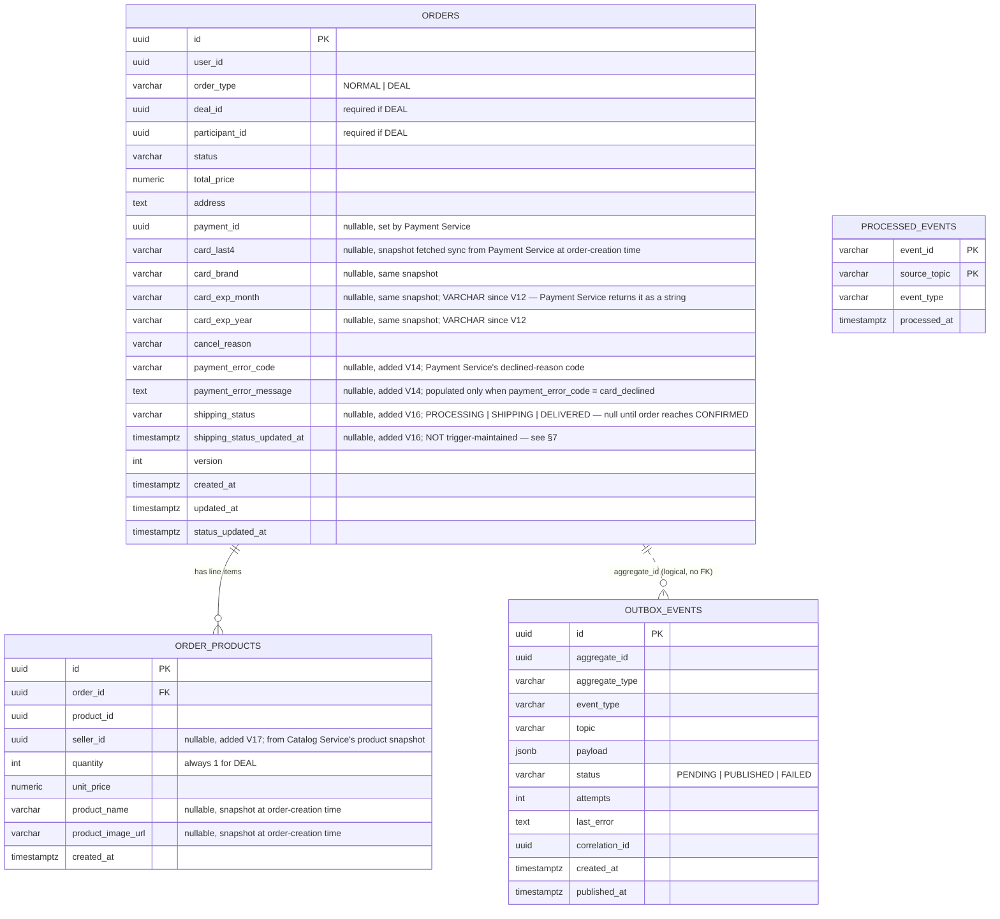
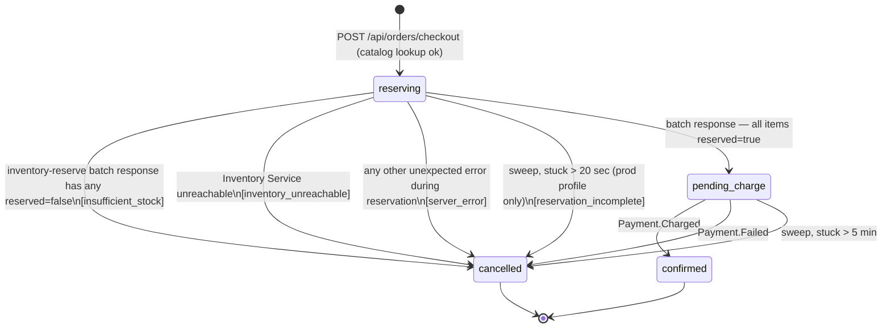
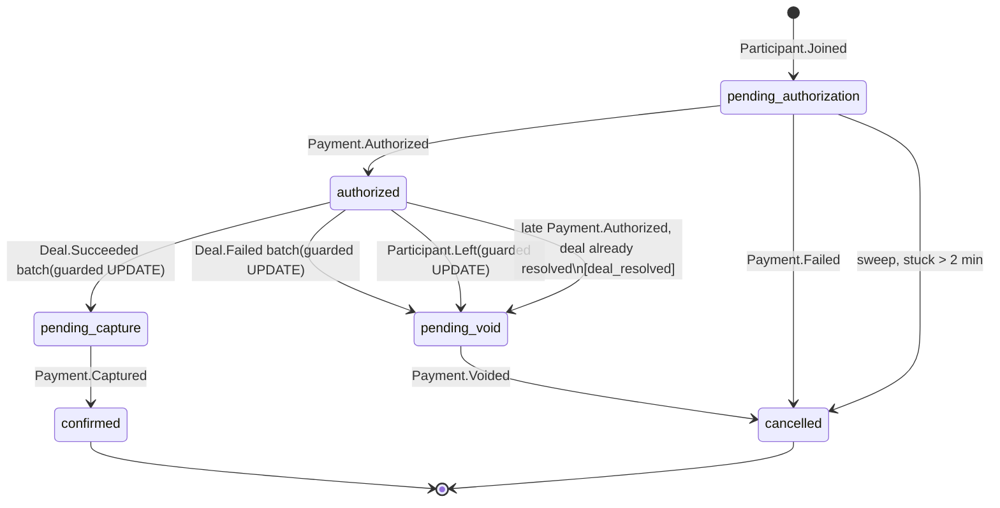
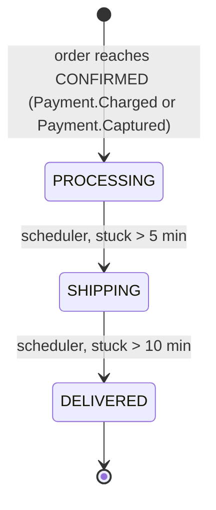

# Order Service — Data Model, Events & Purchase Flows

## 1. Order Data Model (ERD)



**Constraints & indexes not shown above:**
- `orders.status` is one of `RESERVING, PENDING_CHARGE, PENDING_AUTHORIZATION, AUTHORIZED,
  PENDING_CAPTURE, PENDING_VOID, CONFIRMED, CANCELLED`; `cancel_reason` is one of
  `INSUFFICIENT_STOCK, INVENTORY_UNREACHABLE, RESERVATION_INCOMPLETE, PAYMENT_DECLINED,
  PAYMENT_TIMEOUT, DEAL_FAILED, DEAL_RESOLVED, PARTICIPANT_LEFT, SERVER_ERROR` (`SERVER_ERROR`
  added V9, alongside `DEAL_RESOLVED` — see §5 step 4 for when it's used).
- `deal_fields_consistency` check: `deal_id`/`participant_id` set together for `DEAL`,
  both null for `NORMAL`.
- Unique index on `(deal_id, participant_id) WHERE order_type = 'DEAL'` — guards against a
  redelivered `Participant.Joined` creating two orders for the same slot.
- Index on `(status, status_updated_at)` — sweep jobs key off `status_updated_at`, not
  `updated_at`, since `updated_at` bumps on any column change (e.g. setting `payment_id`
  without a status transition).
- Index on `(shipping_status, shipping_status_updated_at)` (V16) — read by
  `ShippingStatusScheduler`'s bulk advance queries (§7), same rationale as the status index above.
- Index on `order_products.seller_id` (V17) — read by every seller-facing query in §3.5–§3.7.
- Two triggers keep `updated_at` and `status_updated_at` accurate automatically, so the order-status
  sweep jobs never depend on application code remembering to set them by hand. **No such trigger
  exists for `shipping_status_updated_at`** — it's set explicitly by application code in the same
  statement that changes `shipping_status` (`initializeShippingStatusIfNull`, `advanceShippingStatus`
  — see §7); a hypothetical direct `UPDATE` on `shipping_status` through any other path would not
  bump it.
- `outbox_events` is the transactional outbox for everything Order Service publishes — the
  publish is part of the same commit as the business write; a relay process (`OutboxRelay`, polling
  every 2s, batches of 100, `SELECT ... WHERE status = 'PENDING' FOR UPDATE SKIP LOCKED`) delivers to
  Kafka at-least-once and retries up to 3 attempts before marking a row `FAILED`.
- `outbox_events.causation_id` and `.trace_id` (added V8) were **dropped in V18** — the schema below
  reflects their removal. Only `correlation_id` remains.
- `processed_events` is inbound Kafka dedup — every consumer checks/inserts here in the
  same transaction as its business write, so at-least-once redelivery is a no-op.
  Primary key is `(event_id, source_topic)`, not `event_id` alone.

---

## 2. Order Status & State Machine

Two independent flows share `orders`. `reserving`/`pending_charge` exist only for
`order_type = NORMAL`; `pending_authorization`/`authorized`/`pending_capture`/`pending_void`
exist only for `order_type = DEAL`. `confirmed` and `cancelled` are terminal for both.
Every transition into a terminal or intermediate state is a conditional
`UPDATE ... WHERE status = <expected>` — this guard makes a reconciliation-sweep cancel
and a late payment event mutually exclusive: whichever commits first wins, the other is a no-op.

Once an order reaches `confirmed`, a second, independent state machine — `shipping_status` — kicks
in and runs to completion on its own clock. See §7.

### 2.1 NORMAL flow



### 2.2 DEAL flow



**Sweep only covers `pending_authorization`**: orders stuck there > 2 min are
**force-cancelled** (`release-slot`, `Order.DealCancelled`, `Payment.Timeout`). See §6 for the
exact thresholds and poll cadence — the sweeper polls every 60s but the staleness threshold
itself is 120s, two different numbers that are easy to conflate.

Three paths park an order in `pending_void`, all via a guarded `UPDATE ... WHERE status =
'authorized'`: the `Deal.Failed` batch (§6 step 3), the participant-leave path (on
`Participant.Left`), and a **late-authorization** race — `Payment.Authorized` is consumed and
the order reaches `authorized`, but the following `authorize-slot` call is rejected because
the deal already resolved. That order is immediately re-parked `authorized → pending_void`
with `cancel_reason = deal_resolved`, `release-slot` is called and `Order.Authorized` is not fired.

---

## 3. Order Service — Endpoints

All endpoints are mounted under `/api/orders`. Buyer-facing endpoints identify the caller via the
`X-User-Id` header (never a path segment or body field); seller-facing endpoints additionally
require `X-User-Role: SELLER` and a `sellerId` path segment that must equal the caller's own
`X-User-Id` — there is no admin/cross-seller override implemented today.

### 3.1 `POST /api/orders/checkout` — Normal checkout

**Headers:** `X-User-Id`

**Request**
```json
{
  "orderItems": [
    { "productId": "8a2c...", "quantity": 2 },
    { "productId": "c091...", "quantity": 1 }
  ],
  "paymentMethodId": "pm_...",
  "address": "123 Main St, Springfield"
}
```

**Response — always `202`.** The endpoint never waits for `Payment.Charged`/`Payment.Failed` —
it returns as soon as catalog lookup, the card-snapshot fetch, order creation, and inventory
reservation have all resolved synchronously. `status` in the body reflects that synchronous
outcome only: `PENDING_CHARGE` (reservation succeeded, charge event just fired) or `CANCELLED`
(reservation failed — see §5 step 4 for which `cancelReason` lands here). It is never `RESERVING`
or `CONFIRMED` at response time.
```json
{
  "id": "ord_...",
  "userId": "b3f1...",
  "orderType": "NORMAL",
  "status": "PENDING_CHARGE",
  "cancelReason": null,
  "totalPrice": 129.97,
  "orderProducts": [
    { "productId": "8a2c...", "productName": "Wireless Mouse", "productImageUrl": "https://cdn.../mouse.jpg", "quantity": 2, "unitPrice": 39.99 },
    { "productId": "c091...", "productName": "USB-C Hub", "productImageUrl": "https://cdn.../hub.jpg", "quantity": 1, "unitPrice": 49.99 }
  ],
  "createdAt": "2026-07-12T10:15:00Z"
}
```

**Errors**
| Status | Cause | Body |
|---|---|---|
| 400 | empty `orderItems`, `quantity < 1`, missing `address`/`paymentMethodId` | `{ "error": "..." }` |
| 404 | a `productId` doesn't exist in Catalog | `{ "error": "..." }` |
| 503 | Catalog Service or Payment Service unreachable during the synchronous lookup/card-snapshot phase (before the order row is even created) | `{ "error": "..." }` |

Note there is no `409`/`503`/`402` path for reservation or payment failures — those land inside a
normal `202` response body as a `CANCELLED` order (see §5).

---

### 3.2 `GET /api/orders/my` — Buyer's order list

**Headers:** `X-User-Id`

**Query params**
| Param | Type | Required | Notes |
|---|---|---|---|
| `status` | string, repeatable | no | one or more of `PENDING_PAYMENT`, `PENDING_DELIVERY`, `DELIVERED`, `CANCELLED` — see mapping table below; multiple values are OR'd |
| `type` | string | no | `NORMAL` \| `DEAL` |
| `page` | int | no | default `1` |
| `limit` | int | no | default `20`, max `100` |

`status` filter values (`BuyerFiltrationOrderStatus`) don't map 1:1 onto `orders.status` — two of
them filter on `shipping_status` instead:

| Filter value | Matches |
|---|---|
| `PENDING_PAYMENT` | `status IN (PENDING_CHARGE, PENDING_AUTHORIZATION, PENDING_CAPTURE, PENDING_VOID)` |
| `PENDING_DELIVERY` | `shippingStatus IN (PROCESSING, SHIPPING)` |
| `DELIVERED` | `shippingStatus = DELIVERED` |
| `CANCELLED` | `status = CANCELLED` |

An order still in `RESERVING` matches none of these values (there's no filter bucket for it) —
it only appears when no `status` filter is passed at all.

**Response — 200**
```json
{
  "orders": [
    {
      "orderId": "ord_...",
      "orderType": "NORMAL",
      "status": "CONFIRMED",
      "shippingStatus": "SHIPPING",
      "noOfItems": 2,
      "totalPrice": 129.97,
      "createdAt": "2026-07-12T10:15:00Z"
    }
  ],
  "page": 1,
  "limit": 20,
  "total": 1
}
```

**Errors**
| Status | Cause |
|---|---|
| 400 | invalid `status`/`type` filter value, bad `page`/`limit` |

---

### 3.3 `GET /api/orders/my/statistics` — Buyer analytics

**Headers:** `X-User-Id`

All-time counts across every order type for the caller — unlike the seller analytics endpoint
(§3.7), there is no date-window parameter.

**Response — 200**
```json
{
  "deliveredOrders": 12,
  "cancelledOrders": 3,
  "pendingDelivery": 2,
  "pendingPayment": 1
}
```
- `deliveredOrders`: `status = CONFIRMED AND shippingStatus = DELIVERED`
- `cancelledOrders`: `status = CANCELLED`
- `pendingPayment`: `status IN (PENDING_CHARGE, PENDING_AUTHORIZATION, PENDING_CAPTURE, PENDING_VOID)`
- `pendingDelivery`: `status = CONFIRMED AND shippingStatus IN (PROCESSING, SHIPPING)`

An order in `RESERVING` is counted in none of these four buckets.

---

### 3.4 `GET /api/orders/{id}` — Single order detail (buyer)

**Headers:** `X-User-Id`

**Response — 200**
```json
{
  "orderId": "c4d2...",
  "userId": "b3f1...",
  "orderType": "NORMAL",
  "dealId": null,
  "participantId": null,
  "status": "CONFIRMED",
  "shippingStatus": "PROCESSING",
  "cancelReason": null,
  "paymentErrorCode": null,
  "paymentErrorMessage": null,
  "totalPrice": 129.97,
  "address": "123 Main St, Springfield",
  "paymentId": "9f4e...",
  "cardLast4": "4242",
  "cardBrand": "visa",
  "cardExpMonth": "12",
  "cardExpYear": "2030",
  "orderProducts": [
    { "productId": "8a2c...", "productName": "Wireless Mouse", "productImageUrl": "https://cdn.../mouse.jpg", "quantity": 2, "unitPrice": 39.99 },
    { "productId": "c091...", "productName": "USB-C Hub", "productImageUrl": "https://cdn.../hub.jpg", "quantity": 1, "unitPrice": 49.99 }
  ],
  "createdAt": "2026-07-12T10:15:00Z",
  "updatedAt": "2026-07-12T10:15:04Z",
  "statusUpdatedAt": "2026-07-12T10:15:04Z"
}
```

A cancelled order (e.g. a card decline) additionally populates `cancelReason`,
`paymentErrorCode`, and — only when `paymentErrorCode` is `card_declined` —
`paymentErrorMessage`:
```json
{
  "status": "CANCELLED",
  "cancelReason": "PAYMENT_DECLINED",
  "paymentErrorCode": "card_declined",
  "paymentErrorMessage": "Your card has insufficient funds."
}
```

**Errors**
| Status | Cause |
|---|---|
| 404 | no order with this `id` |
| 401/403 | requester is not the order's `userId` — there is no admin/seller bypass on this endpoint; a seller uses §3.6 instead |

---

### 3.5 `GET /api/orders/sellers/{sellerId}` — Seller's order list

**Headers:** `X-User-Id` (caller), `X-User-Role` (must be `SELLER`, case-insensitive)

`sellerId` must equal the caller's own `X-User-Id`.

**Only `NORMAL` orders are ever returned** — the underlying query hard-filters
`orderType = NORMAL`. Deal orders' `order_products.seller_id` **is** populated (Catalog is looked
up on `Participant.Joined` the same way — see §6 step 1), but the seller surface never surfaces
them; an order created through a deal is invisible here regardless of `seller_id`. This looks
like an intentional v1 scope cut rather than a bug, but it isn't documented anywhere else, so
flagging it here.

**Query params**
| Param | Type | Required | Notes |
|---|---|---|---|
| `status` | string | no | one of `PENDING`, `CANCELLED`, `PROCESSING`, `SHIPPING`, `DELIVERED` — see `CompactedOrderStatus` table below |
| `startDate` | string | no | `yyyy-MM-dd` or ISO-8601 datetime; default = now − 1 month |
| `search` | string | no | case-insensitive substring match against line-item product name |
| `page` | int | no | default `1` |
| `limit` | int | no | default `20`, max `100` |

**Response — 200**
```json
{
  "orders": [
    {
      "orderId": "ord_...",
      "status": "SHIPPING",
      "type": "NORMAL",
      "createdAt": "2026-07-12T10:15:00Z",
      "items": [
        { "productId": "8a2c...", "productName": "Wireless Mouse", "productImageUrl": "https://cdn.../mouse.jpg", "quantity": 2, "unitPrice": 39.99 }
      ],
      "totalPrice": 79.98
    }
  ],
  "page": 1,
  "limit": 20,
  "total": 1
}
```
- `items` contains **only this seller's own line items** on the order, not the full order's
  product list (a multi-seller order's other items are omitted entirely from this response).
- `totalPrice` here is computed purely from those seller-owned items (`Σ unitPrice × qty`), **not**
  `orders.total_price` — the two diverge whenever an order mixes products from multiple sellers.

**Errors**
| Status | Cause |
|---|---|
| 401/403 | `X-User-Role` isn't `SELLER`, or `sellerId` ≠ caller's `X-User-Id` |
| 400 | invalid `status` value, bad `startDate` format, bad `page`/`limit` |

---

### 3.6 `GET /api/orders/sellers/{sellerId}/{orderId}` — Single order detail (seller)

Same auth rules as §3.5; same `orderType = NORMAL` restriction.

**Response — 200**
```json
{
  "orderId": "c4d2...",
  "status": "SHIPPING",
  "type": null,
  "cancelReason": null,
  "address": "123 Main St, Springfield",
  "createdAt": "2026-07-12T10:15:00Z",
  "totalPrice": 79.98,
  "items": [
    { "productId": "8a2c...", "productName": "Wireless Mouse", "productImageUrl": "https://cdn.../mouse.jpg", "quantity": 2, "unitPrice": 39.99 }
  ]
}
```

**Known gap — `type` is always `null`.** `OrderMapper.toDetailedSellerOrderResponse` has no
`@Mapping` for the `type` target property (unlike its sibling `toBriefSellerOrderResponse`, which
explicitly maps `target = "type", source = "order.orderType"`). This produces a real
`Unmapped target property: "type"` warning at compile time, and the field is never populated in
this response today. Shown above as `null` to reflect actual behavior rather than intent.

**Errors**
| Status | Cause |
|---|---|
| 401/403 | same as §3.5 |
| 404 | no `NORMAL` order with this `id` that has a line item owned by `sellerId` |

---

### 3.7 `GET /api/orders/sellers/{sellerId}/analytics` — Seller analytics

Same auth rules and `orderType = NORMAL` restriction as §3.5.

**Query params**
| Param | Type | Required | Notes |
|---|---|---|---|
| `startDate` | string | no | same parsing as §3.5; default = now − 1 month |

**Response — 200**
```json
{
  "totalOrders": 42,
  "revenue": 3187.50,
  "pendingOrders": 5,
  "deliveredOrders": 30
}
```
- `totalOrders`: distinct orders with at least one seller-owned line item in the date window.
- `pendingOrders`: of those, `status NOT IN (CONFIRMED, CANCELLED)`.
- `deliveredOrders`: of those, `status = CONFIRMED AND shippingStatus = DELIVERED`.
- `revenue`: `Σ unitPrice × qty` over the seller's own line items, across every `CONFIRMED` order
  in the window (not just delivered ones) — cancelled and still-pending orders contribute nothing.

**`CompactedOrderStatus`** (used both as the §3.5/§3.7 `status` filter value and as the displayed
`status`/`type` field in §3.5/§3.6 responses — the two directions aren't quite symmetric):

| Value | As a filter, matches | As a displayed status, shown when |
|---|---|---|
| `PENDING` | `status IN (RESERVING, PENDING_CHARGE)` | `status` is anything other than `CONFIRMED`/`CANCELLED`, **or** `status = CONFIRMED` with `shippingStatus` still `null` |
| `CANCELLED` | `status = CANCELLED` | `status = CANCELLED` |
| `PROCESSING` | `status = CONFIRMED AND shippingStatus = PROCESSING` | `status = CONFIRMED AND shippingStatus = PROCESSING` |
| `SHIPPING` | `status = CONFIRMED AND shippingStatus = SHIPPING` | `status = CONFIRMED AND shippingStatus = SHIPPING` |
| `DELIVERED` | `status = CONFIRMED AND shippingStatus = DELIVERED` | `status = CONFIRMED AND shippingStatus = DELIVERED` |

**Errors**
| Status | Cause |
|---|---|
| 401/403 | same as §3.5 |
| 400 | bad `startDate` format |

---

## 4. Service Contracts

### 4.1 Catalog Service

| Request Endpoint | Request Body | Response Body |
|---|---|---|
| `POST /products/lookup` | `{ "productIds": ["8a2c...", "c091..."] }` | `{ "found": { "8a2c...": { "id": "8a2c...", "sellerId": "d7e1...", "name": "Wireless Mouse", "imageUrl": "https://cdn.../mouse.jpg", "basePrice": 39.99 } }, "notFound": ["c091..."] }` |

`sellerId` on each returned product is what populates `order_products.seller_id` (§1, V17) for
both flows — NORMAL checkout always calls this synchronously and aborts checkout on failure
(§5 step 2); the DEAL join path (§6 step 1) also calls it, but **swallows any failure** and
proceeds with `sellerId`/`productName`/`productImageUrl` left `null` on that line item rather than
failing the join — this is the other half of why deal order_products can lack `seller_id` even
though the lookup is attempted.

### 4.2 Inventory Service

Published events are on `order.lifecycle_events` topic.

Reservation is a single batch call — one request per order, covering every line item,
not one request per product. The batch is **atomic in effect**: if any item can't be
reserved, Inventory Service releases whatever it had already reserved for the other items
in that same call before responding, so a failed batch never leaves a partial reservation
behind. The per-item `reserved: true/false` flags are diagnostic only — they tell Order
Service which product(s) caused the failure; they don't indicate items Order Service needs
to release itself.

| Request Endpoint | Request Body | Response Body |
|---|---|---|
| `POST /order-reserve` | `{ "orderId": "c4d2...", "items": [{"productId": "8a2c...", "quantity": 2}, ...] }` | `{ "orderId": "c4d2...", "items": [{"productId": "8a2c...", "available": 10, "reserved": true}, ...] }` |

| Published Event | Payload |
|---|---|
| `Order.NormalCancelled` | `(orderId, userId, cancelReason, items: [{productId, productName, productImageUrl, quantity, unitPrice}], totalPrice, paymentErrorMessage)` |

### 4.3 Deal Service

Every call carries a `requestId` header — an idempotency key derived deterministically as
`UUID.nameUUIDFromBytes("<operation>:<orderId>")` (e.g. `"authorize-slot:c4d2..."`), so a retried
call after a timeout is safely replayable on Deal Service's side.

| Request Endpoint | Request Body | Expected Action |
|---|---|---|
| `POST /deals/{deal_id}/authorize-slot` | None | increment `authorized_count`, or reject (non-2xx — Order Service treats this as "slot not claimed" and doesn't throw) if the deal has already resolved |
| `POST /deals/{deal_id}/release-slot` | None | decrement `reserved_stock` |
| `POST /deals/{deal_id}/release-authorized-slot` | None | decrement `reserved_stock` & `authorized_count` |

| Received Event | Payload | Reaction |
|---|---|---|
| `Deal.Succeeded` | `(dealId, dealStock, authorizedCount)` | 1. Batch: `SELECT ... WHERE deal_id = ? AND status = 'authorized'`, then per order a guarded `UPDATE ... WHERE id = ? AND status = 'authorized'` → `status = pending_capture`<br>2. Fire `Order.payment_settlement_requested(paymentId, 'CAPTURE')` per order whose guarded update affected a row |
| `Deal.Failed` | `(dealId, reservedStock, authorizedCount)` | 1. Batch: same pattern → `status = pending_void`<br>2. Fire `Order.payment_settlement_requested(orderId, paymentId, 'VOID')` per order whose guarded update affected a row |

### 4.4 Payment Service

- Order Service publishes payment-related events on `order.payments_requested`.
- Order Service receives payment-related events on `payment.events`.
- Order Service additionally makes one **synchronous** call to Payment Service to fetch a
  card snapshot for display, keyed by `(user_id, payment_method_id)` — `user_id` travels as a
  request **header**, not a path segment. The call happens once, at order-creation time
  (DEAL: `Participant.Joined`; NORMAL: checkout).
- The four "success" inbound events below (`Payment.Authorized`, `Payment.Charged`,
  `Payment.Captured`, `Payment.Voided`) all deserialize to the **same** wire shape —
  `(paymentId, orderId, amount)` — Order Service only tells them apart by the `X-Type` Kafka
  header and routes each to a different handler in `PaymentTopicConsumer`.

| Published Event | Payload | Reaction |
|---|---|---|
| `Payment.InitRequired.Charge` | `{userId, orderId, amount, paymentMethodId}` | Charge the amount using `paymentMethodId` |
| `Payment.InitRequired.Authorize` | `{userId, orderId, amount, paymentMethodId}` | Authorize the amount using `paymentMethodId` |
| `Payment.SettlementRequired.Capture` | `{orderId, paymentId}` | Capture the held amount |
| `Payment.SettlementRequired.Void` | `{orderId, paymentId}` | Release the held amount |
| `Payment.Timeout` | `{orderId}` | Cancel a stuck order — fired when no payment outcome ever arrived |

| Sync Call | Request | Response | Reaction |
|---|---|---|---|
| `GET /api/payment-methods/{payment_method_id}` (header `X-User-Id: {user_id}`) | — | `{id, userId, type, isDefault, cardLast4, cardBrand, cardExpMonth, cardExpYear, cardFingerprint}` | Called once at order-creation time; `cardLast4`/`cardBrand`/`cardExpMonth`/`cardExpYear` are stored on the order as part of the same insert. |

| Received Event | Payload | Reaction |
|---|---|---|
| `Payment.Failed` | `(paymentId, orderId, amount, errorMessage, errorCode)` | 1. Get order by `orderId`<br>2. `UPDATE status = cancelled WHERE status IN (pending_charge, pending_authorization)` (guard)<br>3. Set `payment_id` — no card-snapshot fetch here, it was already captured at order-creation time<br>4. Set `payment_error_code`/`payment_error_message` from the event, verbatim — `errorCode` is one of `card_declined`, `incorrect_cvc`, `processing_error`, `expired_card`; `errorMessage` is only populated by Payment Service when `errorCode = card_declined`, otherwise `null`<br>5. DEAL path only: call `release-slot` (sync — `reserved_stock--`; order never reached `authorized`, so `authorized_count` is untouched)<br>6. Fire `Order.NormalCancelled` (NORMAL) or `Order.DealCancelled` (DEAL) |
| `Payment.Charged` | `(paymentId, orderId, amount)` | 1. Get order by `orderId`<br>2. `UPDATE status = confirmed WHERE status = pending_charge` (guard)<br>3. Set `payment_id`<br>4. Initialize `shipping_status = PROCESSING` (only if still `null`)<br>5. Fire `Order.Created` |
| `Payment.Authorized` | `(paymentId, orderId, amount)` | 1. Get order by `orderId`<br>2. `UPDATE status = authorized WHERE status = pending_authorization` (guard)<br>3. Set `payment_id`<br>4. Call `authorize-slot` (sync — `authorized_count++`; deal may flip `succeeded` here)<br>5a. Slot claimed → fire `Order.Authorized`<br>5b. Slot rejected (deal already resolved before this call landed — **late authorization**) → `UPDATE status = pending_void WHERE status = authorized` (guard), `cancel_reason = deal_resolved`, call `release-slot` (not `release-authorized-slot` — Deal Service never counted this slot), fire `Payment.SettlementRequired.Void`; `Order.Authorized` is **not** fired |
| `Payment.Captured` | `(paymentId, orderId, amount)` | 1. Get order by `orderId`<br>2. `UPDATE status = confirmed WHERE status = pending_capture` (guard)<br>3. Set `payment_id` — no card-snapshot re-fetch, same reasoning as above<br>4. Initialize `shipping_status = PROCESSING` (only if still `null`)<br>5. Fire `Order.Created` |
| `Payment.Voided` | `(orderId, paymentId, amount)` | 1. Get order by `orderId`<br>2. `UPDATE status = cancelled WHERE status = pending_void` (guard), `cancel_reason` = `deal_failed`, `participant_left`, or `deal_resolved` depending on which path parked the order<br>3. Set `payment_id` — no card-snapshot re-fetch<br>4. Leave path only: call `release-authorized-slot` (sync — `reserved_stock--` and `authorized_count--` atomically; order had reached `authorized` before parking)<br>5. Fire `Order.DealCancelled` |

No sweep re-publishes `Payment.SettlementRequired.Capture`/`Void` for orders stuck in
`pending_capture`/`pending_void` (there is no third payment sweeper for those states). Resolution
of those two states depends entirely on Payment Service eventually delivering
`Payment.Captured`/`Payment.Voided` on its own.

### 4.5 Participation Service

Published events are on `order.lifecycle_events` topic.

| Published Event | Payload |
|---|---|
| `Order.DealCancelled` | `(orderId, dealId, participantId, userId, reason, items: [{productId, productName, productImageUrl, quantity, unitPrice}], totalPrice)` |

| Received Event | Payload | Reaction |
|---|---|---|
| `Participant.Joined` | `(participantId, dealId, userId, productId, price, paymentMethodId, address, joinedAt)` | 1. Synchronously call `GET /api/payment-methods/{payment_method_id}` (header `X-User-Id`) on Payment Service and capture the card snapshot (`cardLast4`/`cardBrand`/`cardExpMonth`/`cardExpYear`) — failure aborts the whole handler, no order row is created, message is redelivered<br>2. Best-effort Catalog lookup for `productId` (§4.1) — failure here does **not** abort the handler, product snapshot fields are left `null` instead<br>3. Create order row, `status = pending_authorization` (+ `order_products` row), with the card snapshot from step 1, catalog snapshot from step 2, and `address` taken straight from the event with no fallback — `orders.address` is `NOT NULL` (V15), so a `Participant.Joined` that ever omits `address` would fail the insert<br>4. Fire `Payment.InitRequired.Authorize(userId, orderId, amount, paymentMethodId)` |
| `Participant.Left` | `(participantId, dealId)` | 1. Find existing order `WHERE deal_id = ? AND participant_id = ? AND status = authorized` — no new row created<br>2. `UPDATE status = pending_void WHERE status = authorized` (guard — parks the order so deal-resolution batches skip it)<br>3. Fire `Payment.SettlementRequired.Void(orderId, paymentId)` |

### 4.6 Notification Service

Published events are on `order.lifecycle_events` topic.

| Published Event | Payload |
|---|---|
| `Order.Created` | `{orderId, userId, items: [{productId, productName, productImageUrl, quantity, unitPrice}], totalPrice, address}` |
| `Order.Authorized` | `{orderId, dealId, userId, totalPrice}` |
| `Order.NormalCancelled` | `(orderId, userId, cancelReason, items: [{productId, productName, productImageUrl, quantity, unitPrice}], totalPrice, paymentErrorMessage)` |
| `Order.DealCancelled` | `(orderId, dealId, participantId, userId, reason, items: [{productId, productName, productImageUrl, quantity, unitPrice}], totalPrice)` |

---

## 5. Normal Order Flow

1. **Receive & validate.** `POST /api/orders/checkout` payload: non-empty `orderItems`, all
   `quantity > 0`, `address` and `paymentMethodId` present. Malformed request → `400`,
   nothing else touched. (The service does **not** merge duplicate `productId` entries — each
   line item in the request becomes its own `order_products` row as submitted.)

2. **Catalog lookup.** `POST /products/lookup` with every requested `productId` in one call.
  - Any `notFound` → `404` (`ProductNotFoundException` on the first missing id). No order row,
    no reservation, no charge event.
  - `found` entries give the authoritative `basePrice`/`sellerId`/`name`/`imageUrl` per line
    item (never trust a client-supplied price).
  - Catalog Service unreachable → `503`, order row never created.

3. **Create order.** Synchronously call `GET /api/payment-methods/{payment_method_id}`
   (header `X-User-Id`) on Payment Service and capture the card snapshot (`cardLast4`/
   `cardBrand`/`cardExpMonth`/`cardExpYear`) — failure aborts checkout entirely (`503`), no
   order row created. One DB transaction: insert `orders` (`status='RESERVING'`,
   `order_type='NORMAL'`, `total_price = Σ(basePrice × qty)`, `address` from the request,
   card snapshot from above) + one `order_products` row per requested item (`seller_id`,
   `unit_price`, `product_name`, `product_image_url` from step 2).

4. **Inventory reservation.** Single batch call: `POST /order-reserve` with the `orderId` from
   step 3 and every line item (`{productId, quantity}`) in one request — not one call per product.
  - Any item comes back `reserved: false` → `InsufficientStockException` → `cancel_reason = INSUFFICIENT_STOCK`.
  - Inventory Service unreachable (no response) → `ServiceUnavailableException` → `cancel_reason = INVENTORY_UNREACHABLE`.
  - Any other unexpected exception during reservation → `cancel_reason = SERVER_ERROR`.
  - In every one of the three cases: guarded `UPDATE orders SET status='CANCELLED' WHERE id=?
      AND status='RESERVING'`, write `Order.NormalCancelled` to the outbox listing all originally-
    requested items, commit — **and the checkout call still returns `202`** with the cancelled
    order in the response body (§3.1); there is no distinct `409`/`503` HTTP outcome for these
    cases the way an earlier design intended.
  - All items come back `reserved: true` → proceed to step 5.

5. **Charge.** `UPDATE orders SET status='PENDING_CHARGE' WHERE id=? AND status='RESERVING'`,
   write `Payment.InitRequired.Charge` to the outbox (`{userId, orderId, amount,
   paymentMethodId}`), commit, **return `202` immediately**. Order Service never calls
   Payment Service directly to *initiate* the charge, and never waits in-request for the
   outcome — Payment Service consumes this event, charges the card, and publishes
   `Payment.Charged` or `Payment.Failed` asynchronously.

Resolution is either an inbound event or a sweep-fired outbound event.

**Event consumption:**
- **Case 1 — `Payment.Charged`:** `UPDATE orders SET status='CONFIRMED', payment_id=?
  WHERE id=? AND status='PENDING_CHARGE'`; if the update affected a row, initialize
  `shipping_status='PROCESSING'` (only if still `null`) and fire `Order.Created`.
- **Case 2 — `Payment.Failed`:** `UPDATE orders SET status='CANCELLED',
  cancel_reason='PAYMENT_DECLINED' WHERE id=? AND status='PENDING_CHARGE'`; if the update
  affected a row, set `payment_id`, `payment_error_code`, `payment_error_message`, then fire
  `Order.NormalCancelled` (`{orderId, userId, cancelReason, items: [{productId, productName,
  productImageUrl, quantity, unitPrice}], totalPrice, paymentErrorMessage}`). Inventory
  Service reacts the same way it reacts
  to every other `Order.NormalCancelled` (§4.2) — Order Service doesn't call `order-release`
  itself.

**Reconciliation sweeps** — two independent scheduled jobs, each batching up to 100 orders per
tick via `SELECT ... FOR UPDATE SKIP LOCKED`, one order at a time through the same transition
logic the event handlers use:
- `NormalOrderReservationSweeper` polls every 2s (`sweeper.normal-order.reservation.fixed-delay-ms`);
  orders stuck in `RESERVING` for more than **20s**
  (`sweeper.normal-order.reservation.stale-after`) are expired with `RESERVATION_INCOMPLETE`.
  **This sweeper is `@Profile("prod")` only** — under any other active Spring profile, stuck
  `RESERVING` orders are never auto-expired.
- `NormalOrderPaymentSweeper` polls every 2s (`sweeper.normal-order.payment.fixed-delay-ms`);
  orders stuck in `PENDING_CHARGE` for more than **5 min**
  (`sweeper.normal-order.payment.stale-after` = 300s) fire `Payment.Timeout`. Runs under every
  profile.

---

## 6. Deal Order Flow

1. **Join.** Consuming `Participant.Joined`: synchronously call
   `GET /api/payment-methods/{payment_method_id}` (header `X-User-Id`) on Payment Service and
   capture the card snapshot (`cardLast4`/`cardBrand`/`cardExpMonth`/`cardExpYear`) — failure
   aborts the handler entirely, no order row is created and the inbound message is redelivered.
   Separately, best-effort call `POST /products/lookup` on Catalog Service for `productId` — a
   failure here is caught and logged, and the join proceeds anyway with `sellerId`/`productName`/
   `productImageUrl` left `null` on the line item (this is the one place the DEAL flow is more
   forgiving of a downstream failure than NORMAL checkout, which aborts entirely on a catalog
   error). Insert `orders` (`status='PENDING_AUTHORIZATION'`, `order_type='DEAL'`, `deal_id`,
   `participant_id` from the event, `address` taken directly from the event with no fallback —
   `orders.address` is `NOT NULL` since V15, so a `Participant.Joined` without an `address` would
   fail the insert, card snapshot from step 1) + one `order_products` row (`quantity=1`,
   `unit_price` = event's `price`, catalog snapshot from above). Write
   `Payment.InitRequired.Authorize` (`{userId, orderId, amount, paymentMethodId}`) to the outbox
   and commit. No further synchronous call to Payment Service after this step — it consumes this
   event, authorizes the hold, and publishes `Payment.Authorized` or `Payment.Failed`
   asynchronously.

2. **Authorization resolves.**
  - **`Payment.Authorized` consumed:** `UPDATE orders SET status='AUTHORIZED', payment_id=?
     WHERE id=? AND status='PENDING_AUTHORIZATION'` (guard). No card-snapshot fetch here — it
    was already captured at join time (step 1). Call `authorize-slot` on Deal Service
    synchronously (`authorized_count++`; this call may flip the deal to `succeeded` on Deal
    Service's side).
    - Slot claimed → fire `Order.Authorized`.
    - Slot rejected (**late authorization** — the deal already resolved before this call
      landed) → `UPDATE orders SET status='PENDING_VOID', cancel_reason='DEAL_RESOLVED'
          WHERE id=? AND status='AUTHORIZED'` (guard), call `release-slot` (not
      `release-authorized-slot` — Deal Service never counted this slot as authorized),
      fire `Payment.SettlementRequired.Void`. `Order.Authorized` is not fired.
  - **`Payment.Failed` consumed:** `UPDATE orders SET status='CANCELLED',
     cancel_reason='PAYMENT_DECLINED' WHERE id=? AND status='PENDING_AUTHORIZATION'` (guard).
    Set `payment_id`, `payment_error_code`, `payment_error_message` — no card-snapshot fetch,
    same reasoning as above. Call `release-slot`
    (`reserved_stock--`; the order never reached `AUTHORIZED`, so `authorized_count` is
    untouched). Fire `Order.DealCancelled`.

3. **Deal resolves.** Deal Service batches over every order still `AUTHORIZED` for a
   `deal_id`: `SELECT ... WHERE deal_id = ? AND status = 'AUTHORIZED'`, then per order a
   guarded `UPDATE ... WHERE id = ? AND status = 'AUTHORIZED'`:
  - **`Deal.Succeeded` consumed:** per order, guarded `status='AUTHORIZED' → 'PENDING_CAPTURE'`;
    fire `Payment.SettlementRequired.Capture` (`{orderId, paymentId}`) for each order
    whose update affected a row.
  - **`Deal.Failed` consumed:** per order, guarded `status='AUTHORIZED' → 'PENDING_VOID'`;
    fire `Payment.SettlementRequired.Void` (`{orderId, paymentId}`) for each order whose
    update affected a row.

4. **Participant leaves (concurrent path).** Consuming `Participant.Left`: find the
   existing order `WHERE deal_id=? AND participant_id=? AND status='AUTHORIZED'` — no new
   row is created. `UPDATE status='PENDING_VOID' WHERE status='AUTHORIZED'` (guard) parks
   the order so a concurrent `Deal.Succeeded`/`Deal.Failed` batch skips it. Fire
   `Payment.SettlementRequired.Void` (`{orderId, paymentId}`).

5. **Settlement resolves.**
  - **`Payment.Captured` consumed:** `UPDATE orders SET status='CONFIRMED', payment_id=?
     WHERE id=? AND status='PENDING_CAPTURE'` (guard). Initialize `shipping_status='PROCESSING'`
    (only if still `null`). Fire `Order.Created`.
  - **`Payment.Voided` consumed:** `UPDATE orders SET status='CANCELLED',
     cancel_reason=<'DEAL_FAILED'|'PARTICIPANT_LEFT'|'DEAL_RESOLVED'> WHERE id=? AND
      status='PENDING_VOID'` (guard; reason depends on which path parked the order). Leave
    path only (`cancel_reason = 'PARTICIPANT_LEFT'`): call `release-authorized-slot`
    (`reserved_stock--` and `authorized_count--` atomically — the order had reached
    `AUTHORIZED` before parking, unlike the plain `release-slot` case used for
    `DEAL_RESOLVED`/`PAYMENT_DECLINED`). Fire `Order.DealCancelled`.

**Reconciliation sweep**, one job, `DealOrderPaymentSweeper` — polls every **60s**
(`sweeper.deal-order.payment.fixed-delay-ms`) and expires orders that have been stuck in
`PENDING_AUTHORIZATION` for more than **120s / 2 min**
(`sweeper.deal-order.payment.stale-after`) — note the poll cadence and the staleness threshold are
two different numbers. On expiry: **force-cancel** — `UPDATE status='CANCELLED',
cancel_reason='PAYMENT_TIMEOUT' WHERE status='PENDING_AUTHORIZATION'` (guard), call
`release-slot`, fire `Order.DealCancelled` and `Payment.Timeout` (`{orderId}`). Runs under every
profile — unlike `NormalOrderReservationSweeper` (§5), it has no `@Profile` restriction.

---

## 7. Shipping Status Flow

`shipping_status` is a second, independent state machine layered on top of a `CONFIRMED` order.
It never affects `orders.status`, is never communicated to any other service (no outbox event is
ever fired for a `shipping_status` change), and exists purely to drive the buyer/seller read
endpoints in §3.



1. **Initialization.** The instant an order transitions to `CONFIRMED` — via `Payment.Charged`
   (NORMAL, §5) or `Payment.Captured` (DEAL, §6 step 5) — the same transaction runs
   `UPDATE orders SET shipping_status='PROCESSING', shipping_status_updated_at=now() WHERE id=?
   AND shipping_status IS NULL`. The `IS NULL` guard makes this idempotent against a redelivered
   confirming event (which would already have no-opped on the main guarded status `UPDATE`
   anyway, so this is a belt-and-suspenders guard rather than a load-bearing one in practice).

2. **Advancement.** `ShippingStatusScheduler.advanceShippingStatuses()` runs on a cron trigger
   (`scheduler.shipping.cron` = `0 * * * * *`, i.e. once a minute) and issues two plain bulk
   `UPDATE`s (`OrderRepository.advanceShippingStatus`) — no per-order locking, looping, or
   correlation-id/outbox machinery the way the payment/reservation sweepers use:
  - `PROCESSING → SHIPPING` where `shipping_status_updated_at` is older than
    `scheduler.shipping.processing-duration-seconds` = **300s (5 min)**.
  - `SHIPPING → DELIVERED` where `shipping_status_updated_at` is older than
    `scheduler.shipping.shipping-duration-seconds` = **600s (10 min)**.

   Both updates key off the `(shipping_status, shipping_status_updated_at)` index (§1, V16). A
   `DELIVERED` order is terminal — nothing ever advances it further.

3. **Surfacing.** `shipping_status` shows up directly on `BriefOrderResponse`/`DetailedOrderResponse`
   (§3.2, §3.4), is folded into `CompactedOrderStatus` for the seller endpoints (§3.5–§3.7), and
   feeds two of the four buckets in buyer/seller analytics (§3.3, §3.7: `pendingDelivery`/
   `pendingOrders` vs. `deliveredOrders`).

---

## Appendix: SQL Schema

```sql
-- =====================================================================

CREATE EXTENSION IF NOT EXISTS pgcrypto;

-- =====================================================================
-- orders
-- =====================================================================

CREATE TABLE orders (
                        id                UUID PRIMARY KEY DEFAULT gen_random_uuid(),
                        user_id           UUID NOT NULL,
                        order_type        VARCHAR(10) NOT NULL CHECK (order_type IN ('NORMAL', 'DEAL')),

                        deal_id           UUID NULL,               -- required if order_type = 'DEAL'
                        participant_id    UUID NULL,               -- required if order_type = 'DEAL'

                        status            VARCHAR(50) NOT NULL CHECK (status IN (
                                                                                 'RESERVING',
                                                                                 'PENDING_CHARGE',
                                                                                 'PENDING_AUTHORIZATION',
                                                                                 'AUTHORIZED',
                                                                                 'PENDING_CAPTURE',
                                                                                 'PENDING_VOID',
                                                                                 'CONFIRMED',
                                                                                 'CANCELLED'
                            )),

                        total_price       NUMERIC(10,2) NOT NULL CHECK (total_price >= 0),
                        address           TEXT NOT NULL,           -- added V13, backfilled '' and made NOT NULL in V15
                        payment_id        UUID NULL,
                        card_last4        VARCHAR(4) NULL,         -- replaces payment_intent_id, added V11
                        card_brand        VARCHAR(20) NULL,        -- added V11
                        card_exp_month    VARCHAR(2) NULL,         -- SMALLINT in V11, retyped to VARCHAR(2) in V12
                        card_exp_year     VARCHAR(4) NULL,         -- SMALLINT in V11, retyped to VARCHAR(4) in V12
                        cancel_reason     VARCHAR(30) NULL CHECK (cancel_reason IN (
                                                                                    'INSUFFICIENT_STOCK', 'INVENTORY_UNREACHABLE', 'RESERVATION_INCOMPLETE',
                                                                                    'PAYMENT_DECLINED', 'PAYMENT_TIMEOUT', 'DEAL_FAILED', 'DEAL_RESOLVED',
                                                                                    'PARTICIPANT_LEFT', 'SERVER_ERROR'  -- DEAL_RESOLVED & SERVER_ERROR added V9
                            )),
                        payment_error_code    VARCHAR(50) NULL,    -- added V14
                        payment_error_message TEXT NULL,           -- added V14

                        shipping_status            VARCHAR(20) NULL CHECK (shipping_status IN (   -- added V16
                                                                                                    'PROCESSING', 'SHIPPING', 'DELIVERED'
                            )),
                        shipping_status_updated_at TIMESTAMPTZ NULL,   -- added V16, not trigger-maintained (see §1)

                        version           INT NOT NULL DEFAULT 0,
                        created_at        TIMESTAMPTZ NOT NULL DEFAULT now(),
                        updated_at        TIMESTAMPTZ NOT NULL DEFAULT now(),
                        status_updated_at TIMESTAMPTZ NOT NULL DEFAULT now(),

                        CONSTRAINT deal_fields_consistency CHECK (
                            (order_type = 'DEAL'   AND deal_id IS NOT NULL AND participant_id IS NOT NULL) OR
                            (order_type = 'NORMAL' AND deal_id IS NULL AND participant_id IS NULL)
                            )
);

-- Guards against a redelivered participant.Joined creating two orders for the same slot.
CREATE UNIQUE INDEX uq_orders_deal_participant
    ON orders (deal_id, participant_id)
    WHERE order_type = 'DEAL';

CREATE INDEX idx_orders_user_id ON orders (user_id);
CREATE INDEX idx_orders_deal_id ON orders (deal_id);
CREATE INDEX idx_orders_status  ON orders (status);

-- Replaces idx_orders_status_updated_at (status, updated_at) from V1, dropped in V5.
-- Sweep jobs key off status_updated_at, not updated_at — updated_at bumps on
-- any column change, e.g. setting payment_id without a status transition.
CREATE INDEX idx_orders_status_status_updated_at ON orders (status, status_updated_at);

-- Added V16 — read by ShippingStatusScheduler's bulk advance queries (§7).
CREATE INDEX idx_orders_shipping_status_updated_at ON orders (shipping_status, shipping_status_updated_at);

-- Keeps updated_at accurate automatically so sweep jobs don't depend on
-- application code remembering to set it on every status change.
CREATE OR REPLACE FUNCTION set_updated_at()
    RETURNS TRIGGER AS $$
BEGIN
    NEW.updated_at = now();
    RETURN NEW;
END;
$$ LANGUAGE plpgsql;

CREATE TRIGGER trg_orders_updated_at
    BEFORE UPDATE ON orders
    FOR EACH ROW
EXECUTE FUNCTION set_updated_at();


CREATE OR REPLACE FUNCTION set_status_updated_at()
    RETURNS TRIGGER AS $$
BEGIN
    IF NEW.status IS DISTINCT FROM OLD.status THEN
        NEW.status_updated_at = now();
    END IF;
    RETURN NEW;
END;
$$ LANGUAGE plpgsql;

CREATE TRIGGER trg_orders_status_updated_at
    BEFORE UPDATE ON orders
    FOR EACH ROW
EXECUTE FUNCTION set_status_updated_at();

-- Note: there is no equivalent trigger for shipping_status_updated_at — it's set
-- explicitly by application code (initializeShippingStatusIfNull, advanceShippingStatus).

-- =====================================================================
-- order_products
-- =====================================================================

CREATE TABLE order_products (
                                id                 UUID PRIMARY KEY DEFAULT gen_random_uuid(),
                                order_id           UUID NOT NULL REFERENCES orders(id),
                                product_id         UUID NOT NULL,
                                seller_id          UUID NULL,          -- added V17, from Catalog Service's product snapshot
                                quantity           INT NOT NULL CHECK (quantity > 0),   -- always 1 for DEAL, can be >1 for NORMAL
                                unit_price         NUMERIC(10,2) NOT NULL CHECK (unit_price >= 0),
                                product_name       VARCHAR(255) NULL,        -- added V10
                                product_image_url VARCHAR(1000) NULL,        -- added V10
                                created_at         TIMESTAMPTZ NOT NULL DEFAULT now()
);

CREATE INDEX idx_order_products_order_id ON order_products (order_id);
CREATE INDEX idx_order_products_seller_id ON order_products (seller_id);  -- added V17

-- =====================================================================
-- outbox_events
--
-- Transactional outbox for every event Order Service publishes: the publish
-- is part of the same commit as the business write. A relay process polls
-- WHERE status = 'PENDING' and delivers to Kafka at-least-once.
-- =====================================================================

CREATE TABLE outbox_events (
                               id              UUID PRIMARY KEY DEFAULT gen_random_uuid(),
                               aggregate_id    UUID NOT NULL,             -- VARCHAR(100) in V3, restored to UUID in V7
                               event_type      VARCHAR(100) NOT NULL,     -- widened from VARCHAR(50) in V3
                               payload         JSONB NOT NULL,
                               created_at      TIMESTAMPTZ NOT NULL DEFAULT now(),
                               published_at    TIMESTAMPTZ NULL,
                               aggregate_type  VARCHAR(50),               -- added V3
                               topic           VARCHAR(100),              -- added V3
                               status          VARCHAR(20) NOT NULL DEFAULT 'PENDING',  -- added V3
                               attempts        INT NOT NULL DEFAULT 0,    -- added V3
                               last_error      TEXT,                      -- added V3
                               correlation_id  UUID NOT NULL              -- added V6
                               -- causation_id UUID, trace_id UUID: added V8, DROPPED V18
);

CREATE INDEX idx_outbox_events_pending ON outbox_events (created_at) WHERE status = 'PENDING';
CREATE INDEX idx_outbox_events_correlation_id ON outbox_events (correlation_id);
-- idx_outbox_events_trace_id (added V8) was implicitly dropped along with trace_id in V18.

-- =====================================================================
-- processed_events
--
-- Inbound Kafka dedup: every consumer checks/inserts here in the same
-- transaction as its business write, so at-least-once redelivery is a no-op.
-- =====================================================================

CREATE TABLE processed_events (
                                  event_id      VARCHAR(100) NOT NULL,   -- was UUID, retyped in V3
                                  event_type    VARCHAR(100) NOT NULL,   -- widened from VARCHAR(50) in V3
                                  processed_at  TIMESTAMPTZ NOT NULL DEFAULT now(),
                                  source_topic  VARCHAR(100),            -- added V3
                                  PRIMARY KEY (event_id, source_topic)   -- old single-column PK (event_id) dropped in V3
);
```
